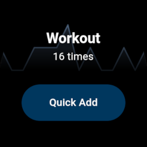

# Logger (Wear)

Wear OS wersion of [Logger](https://github.com/Pomoc48/logger_app),
that allows you to quickly add items to your lists from your smartwatch.

<!--  -->

## Setup

1. Create a [new account](https://loggerapp.lukawski.xyz/#/register) (if you haven't already)
2. Open this app on your watch
3. Generate pairing code
4. Enter the code in a [full version of the app](https://github.com/Pomoc48/logger_app)

The app should now be connected with your account and ready to use.

## License

This project is licensed under the GNU General Public License.
\
Please see the [licence file](LICENSE) for more information.
